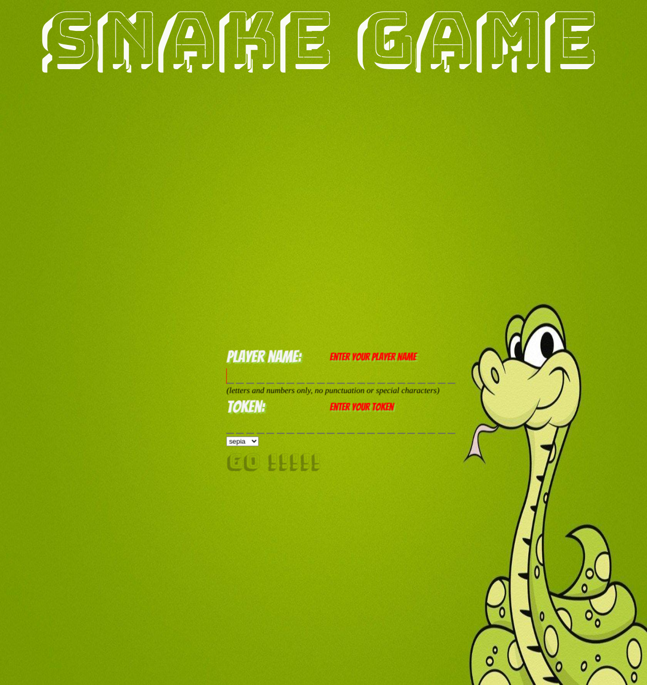
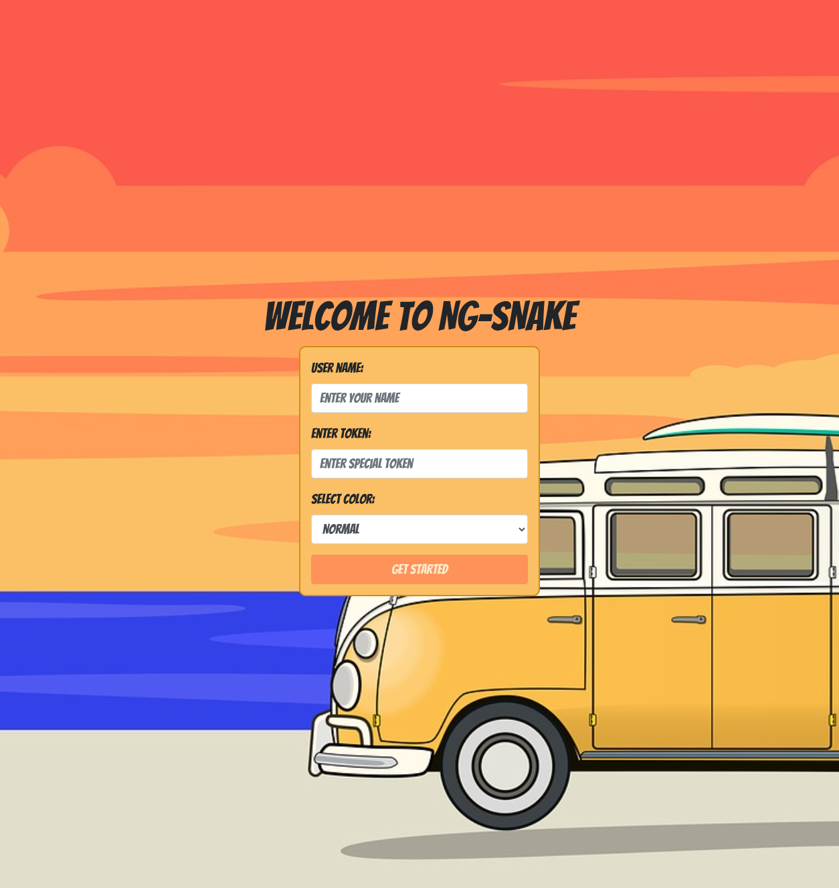

# Angular Developer PB 2023/24

---
## Lectures
### 1. Angular as a framework
[presentation](https://edu.chrum.it/ng-dev-24/lecture_1.html) | [pdf](https://edu.chrum.it/ng-dev-24/pdfs/Angular_developer.lecture_1.pdf) 

### 2. Typescript for angular developer
[presentation](https://edu.chrum.it/ng-dev-24/lecture_2.html) | [pdf](https://edu.chrum.it/ng-dev-24/pdfs/Angular_developer.lecture_2.pdf)

---

## **Exam questions**

There will be [questions](https://github.com/sudheerj/angular-interview-questions) :smiling_imp:  

## Project

Emoji coded:  
:pray: - required (3,4)  
:rocket: - extra points (5)

Requirements:
- :pray: app should consist of 2+ pages (DONT USE ROUTING FOR THAT :smiling_imp: as we dont know routing yet)
- :pray: use ngModel to build form with validators
- :pray: form should be user friendly: display errors and block buttons
- :pray: components communication (inputs, outputs): pass collected data between pages/components
- :rocket: register user interactions and their timing (or any other data than can be use as list)
- :rocket: display list - filterable and sortable (pipes)

### Example project
:pray: Two pages
- Intro page with intro text and player form
- Game page

### Intro page specification
**:pray: basic version**
- some quick introductory text
- form with two inputs
    - player name
    - player email
- start game button
- upon clicking 'start' we check name and email and notify player whats wrong
- if name and email are fine then store this data and move to the game page

### Game page specification
**:pray: basic version**
- there should be a button 'exit game' which will move player to intro page
- there should be nice, personalized welcome message (with player name)
- integrate [ngx-tetris](https://www.npmjs.com/package/ngx-tetris) or [ngx-snake](https://www.npmjs.com/package/ngx-snake) or [ngx-race](https://www.npmjs.com/package/ngx-race)
- big indication of the game status (ready, started, paused...)
- we need points counting mechanism (each cleared line counts)
- display current amount of points
- display time spent wile playing

**:rocket: extra points version should additionally have:**
- there should be a 'gameplay history' with all actions and each entry should have
    - timestamp
    - action name (player started the game, paused, line cleared...)
- gameplay history should be
    - filterable by event type (e.g., show only 'line cleared' events)
    - sortable by timestamp (latest first or oldest first)

### Gallery

</img> 
</img> 

</img>
</img>

</img>
</img>

</img>
</img>

---
  
## Authors

[Chrystian Ruminowicz](http://chrum.it)

## Licence

This project is licensed under the MIT license. See the [LICENSE](LICENSE) file for more info.
