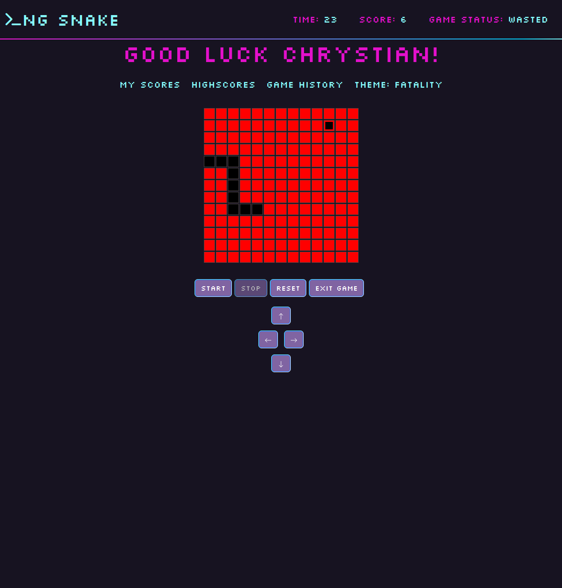

# Angular Developer PB 2023/24

---
## Lectures
### 1. Angular as a framework
[presentation](https://edu.chrum.it/ng-dev-24/lecture_1.html) | [pdf](https://edu.chrum.it/ng-dev-24/pdfs/Angular_developer.lecture_1.pdf) 

### 2. Typescript for angular developer
[presentation](https://edu.chrum.it/ng-dev-24/lecture_2.html) | [pdf](https://edu.chrum.it/ng-dev-24/pdfs/Angular_developer.lecture_2.pdf)

### 3. Template syntax
[presentation](https://edu.chrum.it/ng-dev-24/lecture_3.html) | [pdf](https://edu.chrum.it/ng-dev-24/pdfs/Angular_developer.lecture_3.pdf)

### 4. Components communication, pipes
[presentation](https://edu.chrum.it/ng-dev-24/lecture_4.html) | [pdf](https://edu.chrum.it/ng-dev-24/pdfs/Angular_developer.lecture_4.pdf)

### 5. Basic forms, template reference variables
[presentation](https://edu.chrum.it/ng-dev-24/lecture_5.html) | [pdf](https://edu.chrum.it/ng-dev-24/pdfs/Angular_developer.lecture_5.pdf) | [example](https://stackblitz.com/edit/angular-age-verification-form)

### 6. Basic routing, services and DI
[presentation](https://edu.chrum.it/ng-dev-24/lecture_6.html) | [pdf](https://edu.chrum.it/ng-dev-24/pdfs/Angular_developer.lecture_6.pdf) | [example < 17](https://stackblitz.com/edit/angular-routing-and-services) | [example 17+](https://stackblitz.com/edit/angular17-routing-and-services)

### 7. Lifecycle hooks, http
[presentation](https://edu.chrum.it/ng-dev-24/lecture_7.html) | [pdf](https://edu.chrum.it/ng-dev-24/pdfs/Angular_developer.lecture_7.pdf)
| [hooks example](https://stackblitz.com/edit/angular-sum-lifecycle-hooks)
| [http example](https://stackblitz.com/edit/angular-http-requests-example)


### 8. RxJS
[presentation](https://edu.chrum.it/ng-dev-24/lecture_8.html) | [pdf](https://edu.chrum.it/ng-dev-24/pdfs/Angular_developer.lecture_8.pdf)
| [example](https://stackblitz.com/edit/angular-rxjs-intro)

### 9. Advanced Routing - params, nesting, guards
[presentation](https://edu.chrum.it/ng-dev-24/lecture_9.html) | [pdf](https://edu.chrum.it/ng-dev-24/pdfs/Angular_developer.lecture_9.pdf)
| [example](https://stackblitz.com/edit/advanced-routing)
| [example 17+](https://stackblitz.com/edit/advanced-routing-17-plus)

### 10. Reactive forms
[presentation](https://edu.chrum.it/ng-dev-24/lecture_10.html) | [pdf](https://edu.chrum.it/ng-dev-24/pdfs/Angular_developer.lecture_10.pdf)
| [example](https://stackblitz.com/edit/ng-dev-reactive-forms)

### 11. Reactive forms: custom validators, Content Projection
[presentation](https://edu.chrum.it/ng-dev-24/lecture_11.html) | [pdf](https://edu.chrum.it/ng-dev-24/pdfs/Angular_developer.lecture_11.pdf)
| [validators example](https://stackblitz.com/edit/angular-reactive-forms-custom-validators)
| [content projection example](https://stackblitz.com/edit/angular-content-projection-ex)


---

## **Exam questions**

There will be [questions](https://github.com/sudheerj/angular-interview-questions) :smiling_imp:  
But only from the group below :angel:
```
5, 6, 7, 8, 9, 10, 11, 12, 13, 14, 15, 16, 17, 21, 22, 24, 25, 26, 27, 28, 29, 30, 36, 41, 60, 62, 63, 66, 67, 71, 72, 73, 79, 256, 258, 259
```
## Project

Emoji coded:  
:pray: - required (3,4)  
:rocket: - extra points (5)

1. Routing  
   - :pray: Two pages (intro, game page) -  [details](https://edu.chrum.it/ng-dev-24/lecture_6.html#/0/7)
   - :rocket: Smart componentization - discussable, no pressure, [heres some inspiration](https://edu.chrum.it/ng-dev-24/lecture_6.html#/0/7)
2. Services
   - :pray: storing and reading data - [details](https://edu.chrum.it/ng-dev-24/lecture_6.html#/0/8)
3. Http
    - :pray: reading and displaying highscores - [details](https://edu.chrum.it/ng-dev-24/lecture_7.html#/0/5)
    - :rocket: token verification - [details](https://edu.chrum.it/ng-dev-24/lecture_7.html#/0/6)
    - :rocket: posting scores, my scores - [details](https://edu.chrum.it/ng-dev-24/lecture_7.html#/0/7)

4. Routing params
    - :pray: Add high contrast mode controlled by route param - [details](https://edu.chrum.it/ng-dev-24/lecture_9.html#/0/5)
    - :rocket::rocket: Guarding game route - [details](https://edu.chrum.it/ng-dev-24/lecture_9.html#/0/6)
5. Reactive forms
    - :pray: Convert from on intro page to reactive forms [details](https://edu.chrum.it/ng-dev-24/lecture_10.html#/0/4)

### Gallery

</img> 
</img> 

</img>
</img>

</img>
</img>

</img>
</img>

</img>
</img>

</img>
</img>


---
  
## Authors

[Chrystian Ruminowicz](http://chrum.it)

## Licence

This project is licensed under the MIT license. See the [LICENSE](LICENSE) file for more info.
