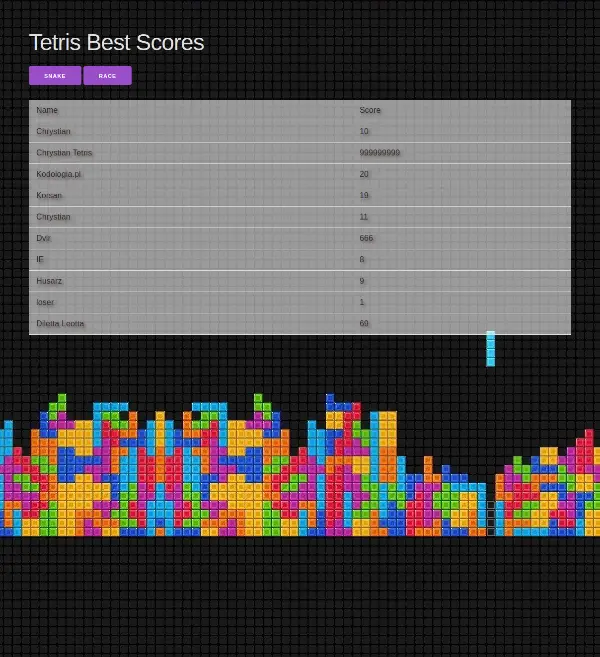
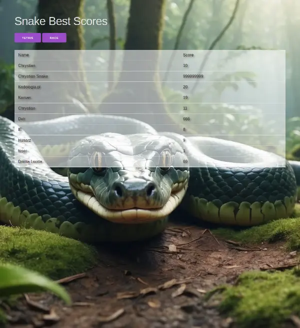

# Games (tetris, snake) api server

## Installation
- Node version: 20
- install dependencies
```bash
npm install
```

## Start server
```bash
npm run start
```
you can optionally provide port the server should listen at with additional param 
```post:{{port_number}}```  
example:
```bash
npm run start port:8080
```

## Using
When server is running then you have access to:  
- High scores page  
[http://localhost:8080](http://localhost:8080) 


[http://localhost:8080/tetris](http://localhost:8080/tetris)|[http://localhost:8080/snake](http://localhost:8080/snake)|[http://localhost:8080/race](http://localhost:8080/race)
:-------------------------:|:-------------------------:|:-------------------------:
  |    |  


- **Api** documentation page  
[http://localhost:8080/docs](http://localhost:8080/docs) 
